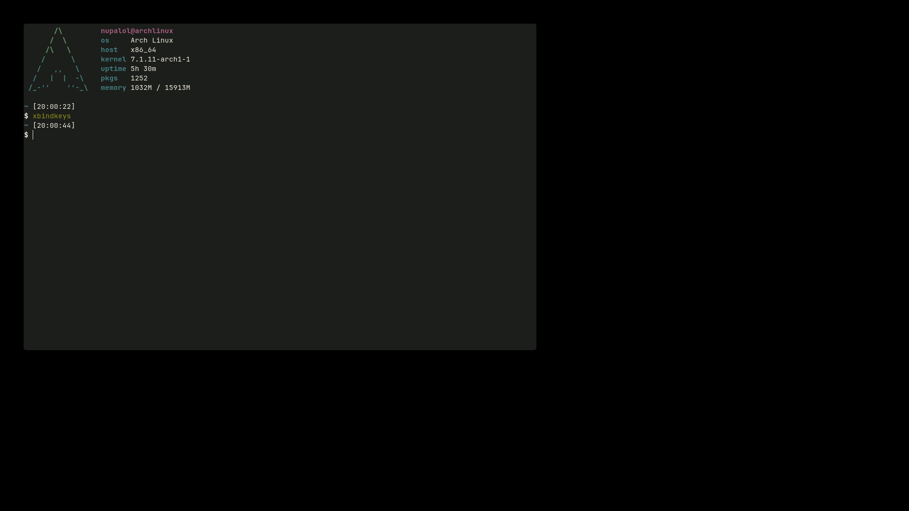
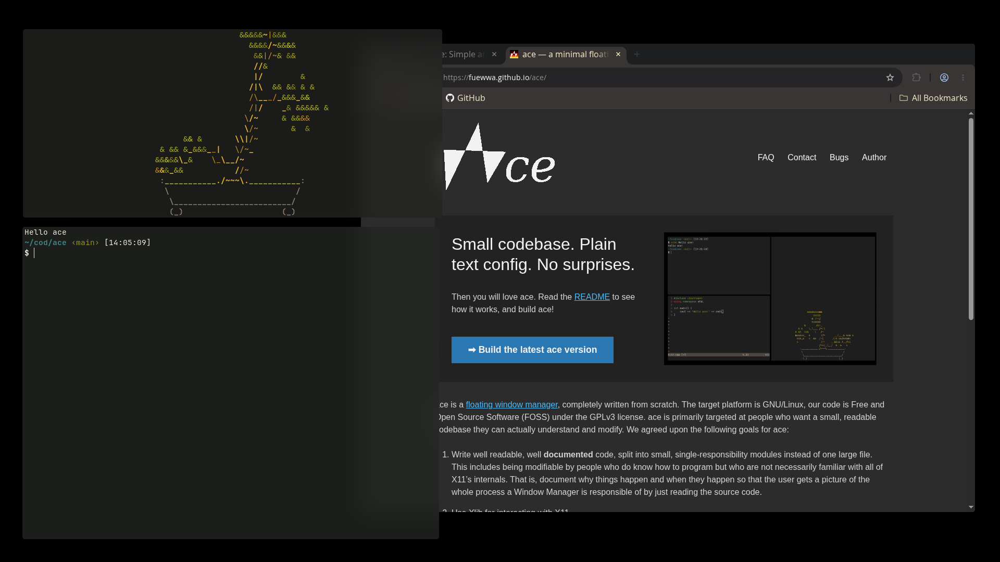
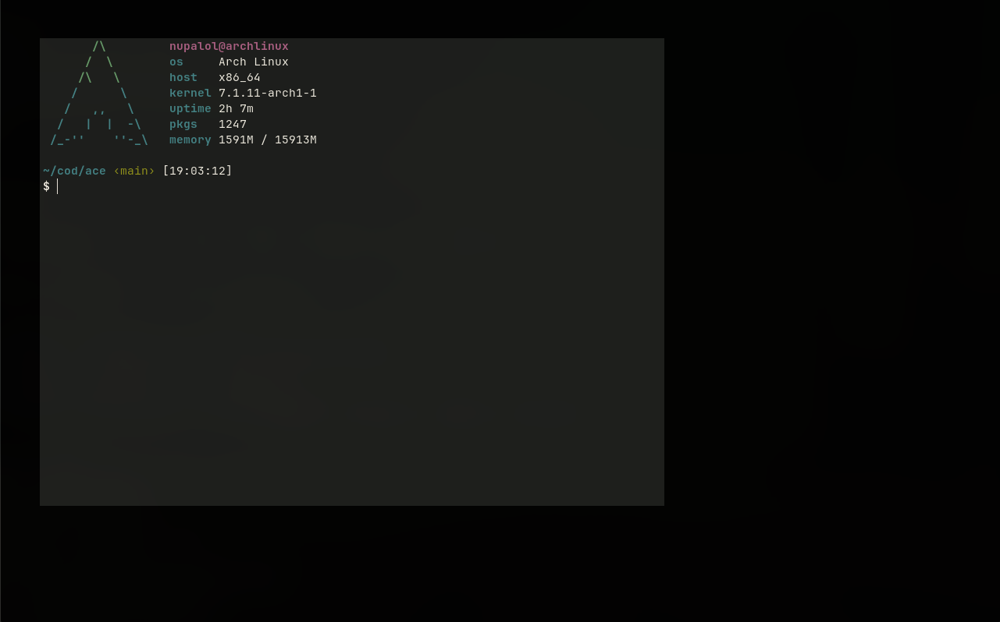

---


A minimal floating window manager for X11, written in C++.

## Features

- Maps new windows as soon as they are created
- Move a window: `Alt` + left mouse button + drag
- Resize a window: `Alt` + right mouse button + drag
- Quit the window manager: `Alt` + `Shift` + `Q`
- Close a window: `Super` + `Q`
- Open the application launcher: `Super` + `D`
- Open a terminal: `Super` + `Space`

## Project layout

```
ace/
├── include/           header files
│   ├── window_manager.h
│   ├── ewmh.h
│   ├── process.h
│   └── config.h
├── src/                source files
│   ├── main.cpp
│   ├── window_manager.cpp
│   ├── ewmh.cpp
│   ├── process.cpp
│   └── config.cpp
├── Makefile
├── README.md
├── run.sh
├── CONTRIBUTING.md
└── ... (Other files)
```

## Apps Dependencies
 
ace itself doesn't launch anything on its own — it relies on external
programs configured by you:
 
- a terminal emulator, defaulting to [alacritty](https://alacritty.org/)
- an application launcher, defaulting to [rofi](https://github.com/davatorium/rofi)

On first run, ace creates a config file at `~/.config/ace/config` (if it
doesn't already exist)
 
You can change `alacritty` (or any other program) to any terminal emulator installed on your
system (e.g. `xterm`, `kitty`, `foot`) — ace will launch whatever you put
there when you press `Super` + `Space`.

## Dependencies

- g++ with C++17 support
- libX11 (headers and library)

On Arch Linux:

```
sudo pacman -S libx11
```

## Building

```
make
```

The `ace` binary will be produced in the project root. You can write `make help` to see Makefile command list

## Running

For testing without leaving your current session, use Xephyr:

```
sudo pacman -S xorg-server-xephyr
Xephyr :1 -screen 1280x800 &
DISPLAY=:1 ./ace
```

Alternatively, the included `run.sh` script does this for you: it
checks that Xephyr is installed and that `ace` has been built, then starts
Xephyr and launches `ace` on `DISPLAY=:1`.
 
```
chmod +x run.sh
./run.sh
```

Then, in that same `DISPLAY=:1`, you can launch any X11 application, e.g.:

```
DISPLAY=:1 xterm
```

To use `ace` as your main window manager, add this to `~/.xinitrc`:

```
exec /path/to/ace
```

and start your session with `startx`.

## Screenshots






## License

This project is licensed under the GNU General Public License v3.0 (GPLv3).
See the `LICENSE` file for the full text.
